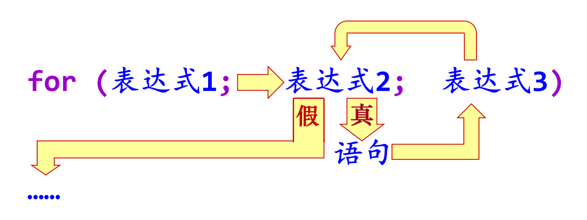
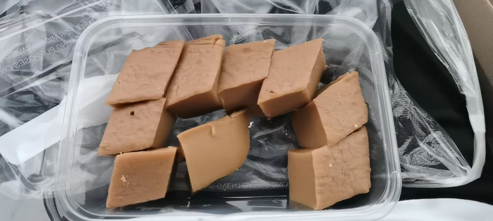

# ReadingTheF**kTextbook——佛脚合集

## c++常用函数与常量

- `cout`, `cin`, `endl`... 常用屏幕输入输出
- `include <cmath>` **(书P34)**
  - `sin`, `cos`, `tan`.
  - `asin`, `acos`, `atan`. 反三角函数
  - `sinh`, `cosh`, `tanh`. 双曲函数
  - `exp` 以 $ e $ 为底的指数函数
  - `log` 平时说的 $ \ln $
  - `log10` 以 10 为底的对数
  - `fabs` `sqrt` `ceil` `floor` `round` 都是输入double型, 输出double型.
  - `double pow(double, double)` `double fmod(double, double)`
- `include <ctime>` **(书P106)**
- `include <cstdlib>` (貌似很多地方不用这个头文件也可以)

## 基本语句
### if

```c++
if (<条件>) <语句1> else <语句2>
```
注意多条语句用大括号

### for

```cpp
for (表达式1; 表达式2; 表达式3) 语句
```
执行（语义）：
（1）求值表达式1（只做一次），用于设变量初值;
（2）求值表达式2，值为 0 时循环结束（循环条件）;
（3）执行语句;
（4）求值表达式3，通常用于循环变量更新;
（5）转到（2）.

<div align = center>

</div>

> 注意：表达式2在进入循环前会进行一次判断（如果第一次就不满足，则循环内的语句一次都不做）

### while

```cpp
while (条件) 语句
```
以及`do-while`:
```cpp
do 语句 while(条件);
```
> `do-while`循环内的语句至少做一次

### swich

```cpp
switch (整型表达式) {
 case 整型常量表达式: 语句序列; break;
 case 整型常量表达式: 语句序列; break;
 .... ....
 default: 语句序列 ; break;
}
```
注意：
- 如果不加`break`就会一路执行到底；
- 一定是**整型常量表达式**。


## 常见程序片段

### 排序
书上只有一个插入排序

```cpp
void insertsort(int n, int a[])
{ //整型数组按照递增序直接插入排序
    int i, j;
    int t;
    for (i = 1; i < n; ++i)
    {
        for (t = a[i], j = i - 1; j >= 0 && t < a[j]; --j)
            a[j + 1] = a[j]; //大元素依次后移
        if (j != i - 1)
            a[j + 1] = t;
    }
}
```
经过向LAB询问，确认最后那个`if`语句不是必须的，不加的话就是多做几次赋值操作

### C++输入输出
### 输入输出流（字符串读取、文件读取） *书P112*
#### 字符串流式输入
要想把字符串类的变量用作输入输出，需要把它们绑定为**输入输出字符串流（string stream）**
- istringstream类——输入; 
- ostringstream类——输出;
- strstream类——输入输出.

程序中需要包含头文件 `sstream`: 
```cpp 
#include <sstream>
```
把一个字符串类的变量绑定为字符串输入流: 
```cpp
istringstream inss(str);
```
inss就成为了一个输入流，可以类似于cin一样用提取运算
符“>>”进行输入操作。例如：
```cpp
inss >> n; //从inss中读取一个数据并赋给整型变量n
```


## 数组使用注意点

## 指针使用注意点 <!-- 上机考试我还是能不用就不用了吧…实在是不会 -->

## 结构体使用注意点 <!-- 同前，不会 -->

## 经典例题

## something ~~interesting~~ difficult
### 尾递归（不会）
### 汉诺塔（不会）

## 零散注意点

```cpp
	string str2 = "Hello, World!";
	cout << str2[1] << endl; // OK
	// cout << *(str2) << endl; //Fail

	char str1[] = "Hello, World!";
	cout << str1[1] << endl; // OK
	cout << *(str1) << endl; // OK
```

<div align = center>
    
</div>